# Inventory & Order Management System

A full-stack web application that keeps inventory, orders, suppliers, and staff activity in sync. The frontend is built with **React 18**, while the backend is powered by **ASP.NET Core 9** with **MongoDB** for persistence.

## 🎯 Features

- **Authentication**: JWT login and registration with Admin and Staff roles out of the box
- **Product Management**: Full CRUD with category and supplier relationships
- **Order Management**: Sales and purchase orders with detailed line items
- **Supplier Management**: Track supplier contacts and availability
- **Dashboard**: Overview cards, charts, and low-stock warnings
- **Responsive UI**: Material UI theme that scales from desktop to mobile
- **API Documentation**: Self-hosted Swagger/OpenAPI spec

## 🧱 Tech Stack

### Backend
- **Framework**: ASP.NET Core 9
- **Language**: C#
- **Database**: MongoDB (Atlas or self-hosted)
- **Data Access**: MongoDB.Driver
- **Authentication**: JWT Bearer Tokens
- **API Docs**: Swagger/OpenAPI

### Frontend
- **Framework**: React 18
- **UI Library**: Material UI (MUI) v5
- **Charts**: Recharts
- **HTTP Client**: Axios
- **Router**: React Router v6
- **Icons**: MUI Icons

## 📋 Prerequisites

- **.NET 9 SDK** - [Download](https://dotnet.microsoft.com/en-us/download/dotnet/9.0)
- **Node.js** (v18+) - [Download](https://nodejs.org/)
- **MongoDB** (Atlas cluster or local instance)
- **VS Code** or **Visual Studio**

## 🚀 Getting Started

### Backend Setup

1. **Navigate to the server folder**
```bash
cd "Inventory & Order Management System\server"
```

2. **Copy the environment template and fill values**
```bash
copy .env.example .env
```

Set `MongoDb__ConnectionString` to your MongoDB URI and `JwtSettings__Secret` to a 32-character key.

3. **Restore dependencies**
```bash
dotnet restore
```

4. **Run the server**
```bash
dotnet run
```

The API listens on `http://localhost:5001` (HTTP) and `https://localhost:5002` (HTTPS).

Swagger documentation is available at `https://localhost:5002/swagger` in development.

### Frontend Setup

1. **Navigate to the client folder**
```bash
cd "Inventory & Order Management System\client"
```

2. **Install dependencies**
```bash
npm install
```

3. **Start the React app**
```bash
npm start
```

The app opens at `http://localhost:3000`.

## 📱 Default Credentials

### Test Admin Account
- **Username**: admin
- **Email**: admin@inventory.com
- **Password**: Admin@123

### Test Staff Account
- **Username**: staff
- **Email**: staff@inventory.com
- **Password**: Staff@123

These accounts seed automatically on first run.

## 🖼 Screenshots

### 🔐 Authentication
<p align="center">
  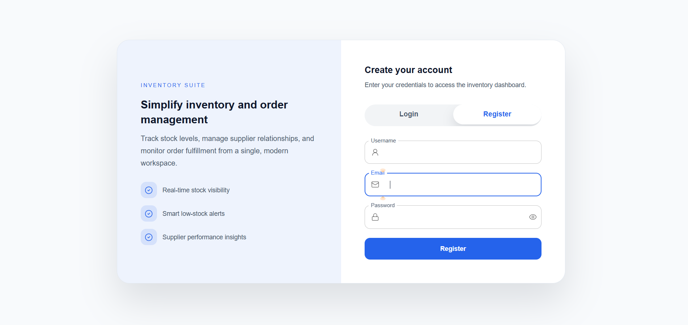
  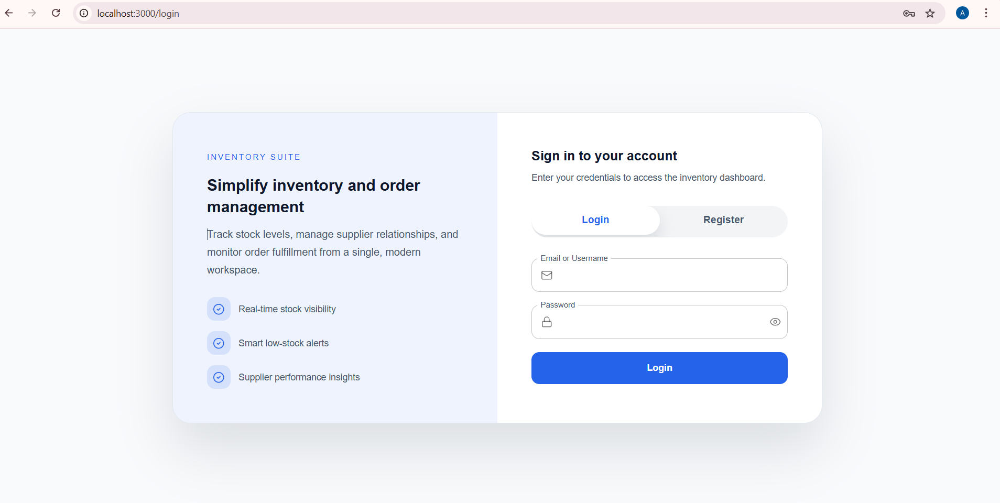
</p>

---

## 🧑‍💼 Admin Panel

### 📊 Dashboard
<p align="center">
  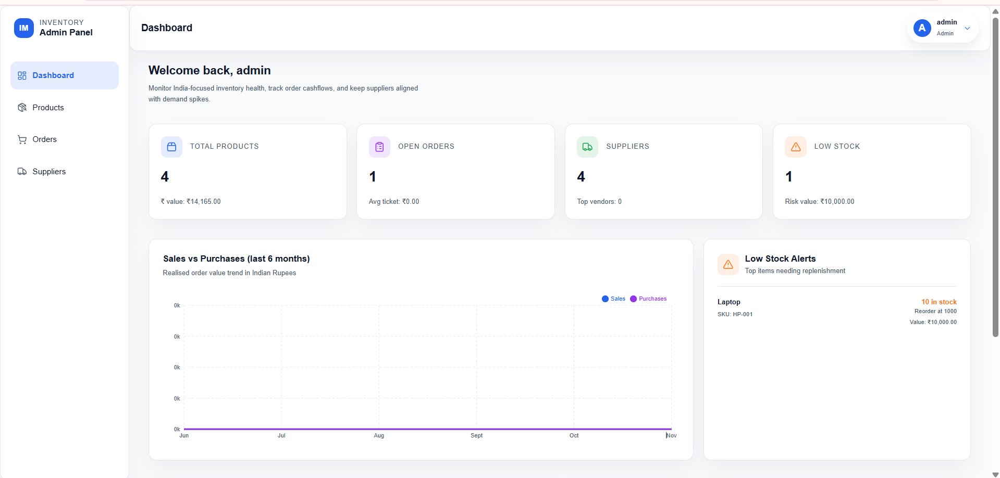
  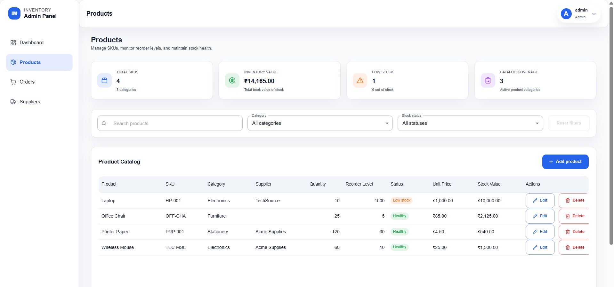
</p>

### 📦 Orders
<p align="center">
  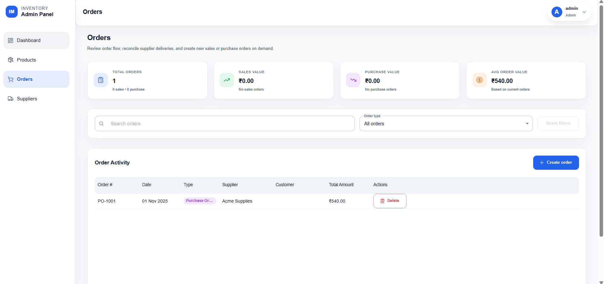
</p>

### 🚚 Suppliers
<p align="center">
  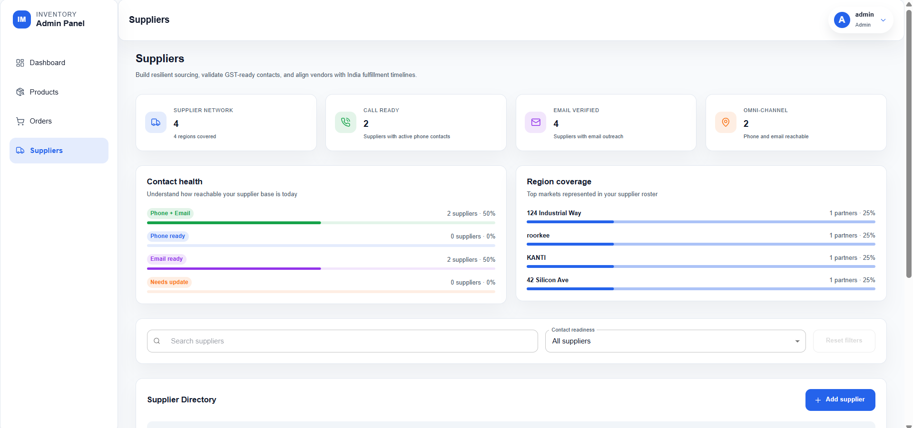
  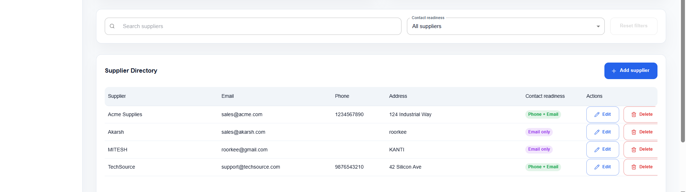
</p>

---

## 👩‍💼 Staff Panel

### 📊 Dashboard
<p align="center">
  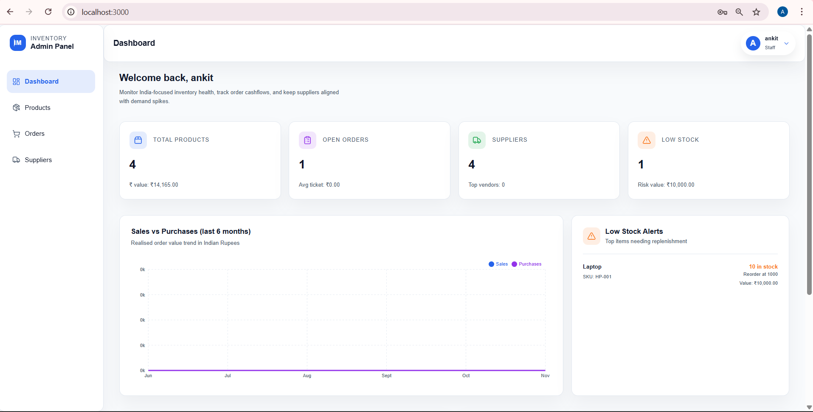
  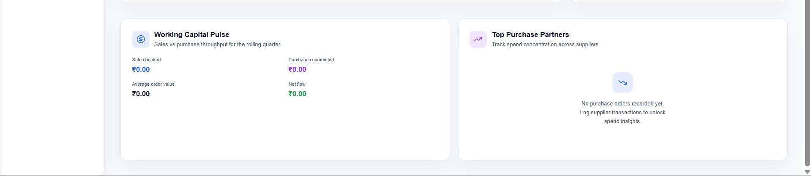
</p>

### 🛒 Products
<p align="center">
  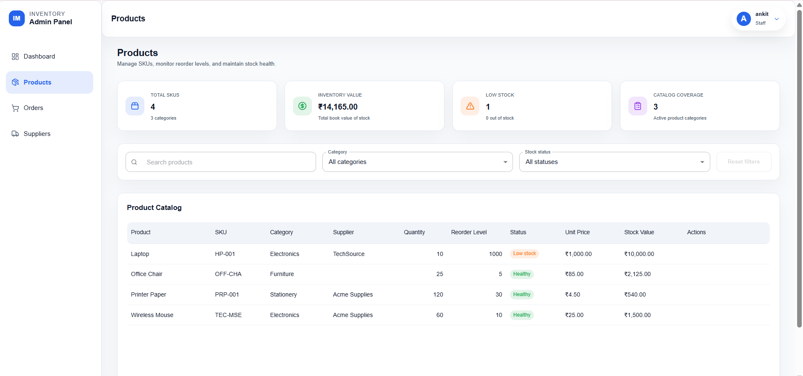
</p>

### 📦 Orders
<p align="center">
  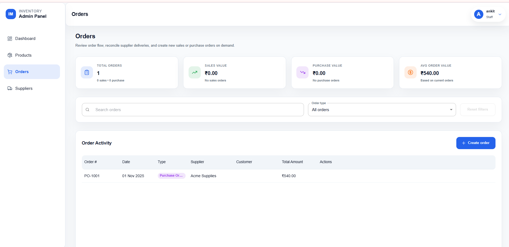
</p>

### 🚛 Suppliers
<p align="center">
  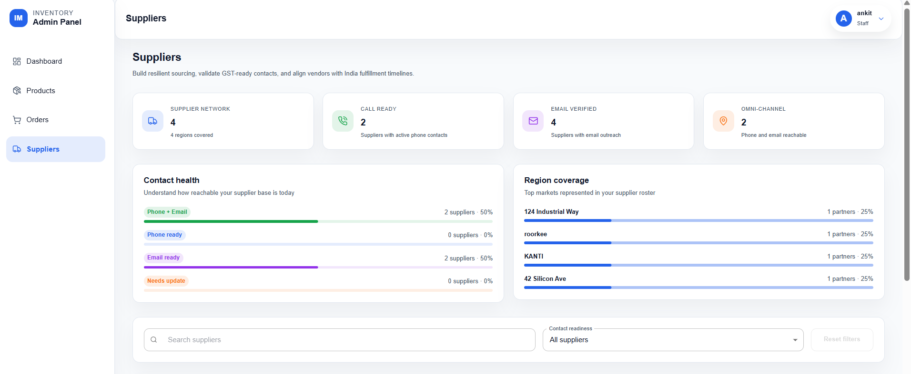
  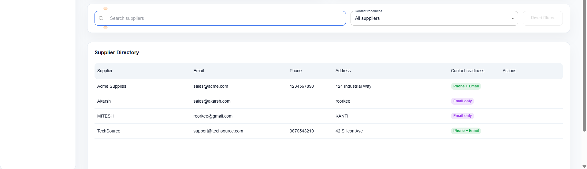
</p>


## 📁 Project Structure

```
Inventory & Order Management System/
│
├── server/                          # Backend (.NET 9)
│   ├── Controllers/                # API endpoints
│   │   ├── AuthController.cs
│   │   ├── ProductController.cs
│   │   ├── OrderController.cs
│   │   ├── SupplierController.cs
│   │   └── CategoryController.cs
│   ├── Services/                   # Business logic
│   ├── Models/                     # Domain models
│   ├── DTOs/                       # Data transfer objects
│   ├── Data/                       # Database context
│   ├── Helpers/                    # JWT, Response wrappers
│   ├── Program.cs                  # Startup configuration
│   ├── appsettings.json
│   └── server.csproj
│
└── client/                          # Frontend (React)
    ├── public/
    │   └── index.html
    ├── src/
    │   ├── api/                    # API client setup
    │   │   ├── axiosClient.js
    │   │   └── endpoints.js
    │   ├── components/             # Reusable components
    │   │   ├── Navbar.js
    │   │   ├── Sidebar.js
    │   │   ├── MainTable.js
    │   │   └── DashboardCard.js
    │   ├── pages/                  # Page components
    │   │   ├── Login.js
    │   │   ├── Dashboard.js
    │   │   ├── Products.js
    │   │   ├── Orders.js
    │   │   └── Suppliers.js
    │   ├── utils/                  # Utility functions
    │   ├── theme/                  # MUI theme
    │   ├── App.js
    │   └── index.js
    └── package.json
```

## 🔌 API Endpoints

### Authentication
- `POST /api/auth/login` - Authenticate user
- `POST /api/auth/register` - Register new user

### Products
- `GET /api/product` - Get all products
- `GET /api/product/{id}` - Get product by ID
- `POST /api/product` - Create product (Admin only)
- `PUT /api/product/{id}` - Update product (Admin only)
- `DELETE /api/product/{id}` - Delete product (Admin only)

### Orders
- `GET /api/order` - Get all orders
- `GET /api/order/{id}` - Get order by ID
- `POST /api/order` - Create order
- `DELETE /api/order/{id}` - Delete order (Admin only)

### Suppliers
- `GET /api/supplier` - Get all suppliers
- `GET /api/supplier/{id}` - Get supplier by ID
- `POST /api/supplier` - Create supplier (Admin only)
- `PUT /api/supplier/{id}` - Update supplier (Admin only)
- `DELETE /api/supplier/{id}` - Delete supplier (Admin only)

### Categories
- `GET /api/category` - Get all categories
- `GET /api/category/{id}` - Get category by ID
- `POST /api/category` - Create category (Admin only)
- `PUT /api/category/{id}` - Update category (Admin only)
- `DELETE /api/category/{id}` - Delete category (Admin only)

## 🔐 Security Features

- JWT authentication with configurable expiration
- Role-based access control for Admin and Staff
- CORS policy scoped to the React frontend
- Password hashing with BCrypt
- Secure token persistence in localStorage

## 📊 Database Schema

### Core Collections
- **Users**: Authentication and role metadata
- **Products**: Inventory items with SKU, pricing, and stock levels
- **Categories**: Product categorization
- **Suppliers**: Supplier contact information
- **Orders**: Sales and purchase orders
- **OrderItems**: Embedded line items on orders

## 🛠️ Configuration

### JWT Settings (appsettings.json)
```json
"JwtSettings": {
  "Secret": "your-very-secret-key-min-32-characters-long!",
  "Issuer": "InventoryApp",
  "Audience": "InventoryAppUsers",
  "ExpiryMinutes": 60
}
```

⚠️ **Important**: Replace the JWT secret before deploying.

### CORS Configuration
Allowed frontend URLs by default:
- `http://localhost:3000`
- `https://localhost:3000`

## 📝 Development Notes

### Adding New Features

1. **Backend**: Add model → DTO → Service → Controller
2. **Frontend**: Create API client → Component → Page integration

### Code Style
- C#: Microsoft naming conventions
- React: Functional components with hooks
- Naming: camelCase for JS, PascalCase for C#

## 🐛 Troubleshooting

### Database Connection Issues
- Ensure MongoDB (local or Atlas) is reachable
- Confirm the `MongoDb__ConnectionString` value in `.env`
- Verify credentials, `authSource`, and Atlas network rules

### Port Already in Use
- Backend default: 5001 (change in `server/Properties/launchSettings.json`)
- Frontend default: 3000 (React prompts for an alternative)

### CORS Errors
- Confirm backend CORS policy includes your frontend URL
- Check that the Authorization header is present on requests

## 📚 Additional Resources

- [ASP.NET Core Documentation](https://docs.microsoft.com/aspnet/core)
- [React Documentation](https://react.dev)
- [Material UI Documentation](https://mui.com)
- [MongoDB .NET Driver Documentation](https://www.mongodb.com/docs/drivers/csharp/)

## 👥 Role-Based Features

### Admin
- Full CRUD for products, categories, and suppliers
- Create and delete orders
- Access all management dashboards

### Staff
- View products, orders, and suppliers
- Create orders
- Read-only access to reports

## 🚢 Deployment

### Backend (Azure/Render)
1. Build: `dotnet publish -c Release`
2. Deploy the published folder to your hosting service
3. Set environment variables for MongoDB connection string and JWT secret

### Frontend (Vercel/Netlify)
1. Build: `npm run build`
2. Deploy the `build` folder to the hosting platform
3. Set the API URL in `.env.production`

## 👤 Author

Built with care by **Mitesh Anshu** — [miteshanshu1@gmail.com](mailto:miteshanshu1@gmail.com).

## 📄 License

This project is provided as-is for educational and commercial use.

---

**Last Updated**: November 2025
